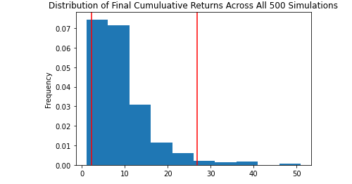

This project creates an environment where Monte Carlo simulations can calculate outcomes of different portfolios. The outcomes differ based on the initial investment, time period invested, the diversification of the portfolio and the number of simulations conducted. 

## The Project

### Personal Finance Planner
Investments are retrived throught the following API's:

Alpaca Markets API will be utilised to retreive historical data for stocks and bonds. 
* [AlpacaDOCS](https://alpaca.markets/docs/)
  
The Alternative Free Crypto API will be utilised to retrieve the relevant cryptocurreny data. 
* [Free Crypto API Documentation](https://alternative.me/crypto/api/)

Utilising the investment information an analysis is conducted on the current savings, monthly income and investment value. These variables are used to determine the financial health of the situtaion.

### Retirment Planning

Using the information retrieved using the APIs, Monte Carlo simulations are conducted to determine the potential outcomes for the portfolio in a specific ratio of investments.

Following exceution of the simulation outputs will be displayed. 

* Monte Carlo Cumulative Return Trajectories

* Distribution of Final Cumulative Returns

### Early Retirement

Methods used in the previous areas of the project are used to determine which direction an investment portfolio can be optimised to predict returns that can be used for an Early Retirement strategy.

Utilisation of the Monte Carlo simulation are used to determine if different portfolio ratios and initial investment changes are going to be beneficial in an attempt to predict the feasability of an Early Retirement. 
